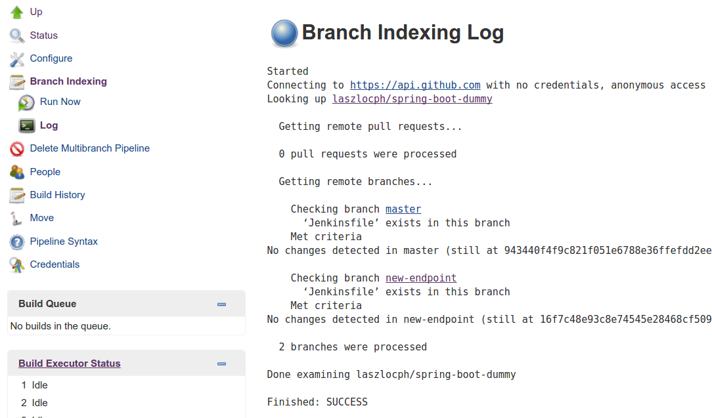

## Mastering test environments with Docker

---

**tldr**
In this article I show how to work with Docker Compose to have tailored local or QA environments 

<iframe width="560" height="315" src="https://www.youtube.com/embed/Uu0v-ZDlYDI" frameborder="0" allowfullscreen></iframe>

 ---

In the [first part](Simple-Jenkins-and-Docker-workflow) of the series I addressed three out of four requirements

* we build in an independent environment
* we version the build environment together with the source code
* so as we version the build pipeline in the source repository

The last outstanding requirement makes the workflow so exciting to me, **the ability to provision an environment with a handpicked set of components and branches** unlocks productivity to a great extent.
 

## Build every branch
But first we have to make sure that all branches get built automatically. 

Besides the Jenkinsfile, **Jenkins has another new feature in 2.0, it is now aware of branches in the source code repository.** 
This nifty feature spares us a ton of boilerplate work as we don't have to set up new instances of the build pipeline for every branch ourselves.

By picking *Multibranch Pipeline* on the job creation page we get the same behavior as the *Pipeline* job, plus Jenkins automatically creates a sub-project for each branch with a Jenkinsfile that it finds in the repository.


We also got a new item on the side bar to reindex branches on demand. It is able to detect new branches and delete pipelines that belong to deleted ones.
 


I made one more modification to the pipeline to make it practically useful. In this new final step I **push the built Docker container image to a [registry](https://hub.docker.com/r/laszlocph/spring-boot-dummy/tags/)**. 
With this step the container becomes available to other processes for verification and deployment.

## Define stacks
At this point components are built continuously on every branch. As a next step I describe their interrelatedness with [Docker Compose](https://docs.docker.com/compose/) and handle them as a logical unit to bring up local and later remote environments.

Docker Compose has a simple yaml syntax, and while it has [powerful options](https://docs.docker.com/compose/compose-file/), it is very easy to define simple stacks.

<pre>
version: '2'

services:
 web-python:
   image: laszlocph/composetest
   ports:
    - "5000:5000"
   depends_on:
    - redis
 boot:
   image: laszlocph/spring-boot-dummy
 redis:
   image: redis

</pre>

Above I defined three services, 
* *web-python* is based on a dummy webapp, the laszlocph/composetest image that depends on a running redis container
* *boot* is the well known Spring Boot application from part one.
* *redis* is just a vanilla Redis container

Running this stack takes nothing more than executing the **docker-compose up** command. We don't have to fiddle with individual *docker run* commands as
it will start all containers in the right order, with the right volumes and exposed ports just as they are described in the docker-compose file. 

Furthermore it defines a Docker network, so the services are able to communicate with each other in separation to other network traffic. 
They can do that by simply mentioning each other's name as Compose puts an entry in the containers host file with all available services and their IPs.

Once the services are up you can verify the containers with the *docker ps* command as they are completely regular containers. Docker Compose seamlessly integrates with other Docker tools.

<pre>
laszlo@~/multi-env: docker-compose up
Creating network "multienv_default" with the default driver
Creating multienv_boot_1
Creating multienv_redis_1
Creating multienv_web-python_1
Attaching to multienv_boot_1, multienv_redis_1, multienv_web-python_1
boot_1        | 
boot_1        |   .   ____          _            __ _ _
boot_1        |  /\\ / ___'_ __ _ _(_)_ __  __ _ \ \ \ \
boot_1        | ( ( )\___ | '_ | '_| | '_ \/ _` | \ \ \ \
boot_1        |  \\/  ___)| |_)| | | | | || (_| |  ) ) ) )
boot_1        |   '  |____| .__|_| |_|_| |_\__, | / / / /
boot_1        |  =========|_|==============|___/=/_/_/_/
boot_1        |  :: Spring Boot ::        (v1.4.0.RELEASE)
boot_1        | 
redis_1       | 1:C 12 Oct 09:33:23.093 # Warning: no config file specified, using the default config. In order to specify a config file use redis-server /path/to/redis.conf
redis_1       |                 _._                                                  
redis_1       |            _.-``__ ''-._                                             
redis_1       |       _.-``    `.  `_.  ''-._           Redis 3.2.4 (00000000/0) 64 bit
redis_1       |   .-`` .-```.  ```\/    _.,_ ''-._                                   
redis_1       |  (    '      ,       .-`  | `,    )     Running in standalone mode
redis_1       |  |`-._`-...-` __...-.``-._|'` _.-'|     Port: 6379
redis_1       |  |    `-._   `._    /     _.-'    |     PID: 1
redis_1       |   `-._    `-._  `-./  _.-'    _.-'                                   
redis_1       |  |`-._`-._    `-.__.-'    _.-'_.-'|                                  
redis_1       |  |    `-._`-._        _.-'_.-'    |           http://redis.io        
redis_1       |   `-._    `-._`-.__.-'_.-'    _.-'                                   
redis_1       |  |`-._`-._    `-.__.-'    _.-'_.-'|                                  
redis_1       |  |    `-._`-._        _.-'_.-'    |                                  
redis_1       |   `-._    `-._`-.__.-'_.-'    _.-'                                   
redis_1       |       `-._    `-.__.-'    _.-'                                       
redis_1       |           `-._        _.-'                                           
redis_1       |               `-.__.-'                                               
redis_1       | 
...
web-python_1  |  * Running on http://0.0.0.0:5000/ (Press CTRL+C to quit)
web-python_1  |  * Restarting with stat
web-python_1  |  * Debugger is active!
web-python_1  |  * Debugger pin code: 238-470-859

</pre>

## Operating Docker Compose


You can get the true power of Docker Compose from its [CLI reference](https://docs.docker.com/compose/reference/), I only want to highlight a few commands that can get you very far:

* *docker-compose up -d* to run a stack detached
* *docker-compose logs -f* to tail a stack's output
* *docker-compose ps* to see the state of the stack
* *docker-compose stop* to stop a stack
* *docker-compose rm* to clean up once you are done

## Value in running Compose

If you version your compose file together with the source code it guarantees that anyone in the team can run the stack locally, but because Docker Compose integrates with other Docker tools you can also point it at a remote machine, 
or a cluster of Docker Engines. You can start up a QA environment or even a production stack just as easy as running one locally. And that has huge value for me. 

Imagine when a new colleague joins the team and she has a local environment up and running within fifteen minutes. Or when she has her first feature ready to showcase, she can share the QA environment with the team with a single command. 
**Now this is what I call proper onboarding.** 

## Running a stack remotely

First, let's create a remote environment with an other Docker tool. Docker Machine allows me to provision easily a VM with Docker Engine installed, be that locally with VirtualBox or remotely on Amazon AWS or Azure.

<pre>
docker-machine create --driver virtualbox composeHost
</pre>

Docker Machine - just like Vagrant - pulls in an image and launches a VM in Virtualbox and also provides convenience methods to operate the VM. 

Notable commands are:

* docker-machine ls
* docker-machine ssh <VM name>
* docker-machine stop <VM name>
* docker-machine rm <VM name>

Once the new node is running I can point my docker executable to it by running 

<pre>
eval $(docker-machine env composeHost)
</pre>

**From this moment on, every docker command I run is not executed locally, but on the remote host.** 
This may look magical, but what happens in the background is that it sets a few environment variables that is regarded by the docker executable.

<pre>
laszlo@~: docker-machine env composeHost
export DOCKER_TLS_VERIFY="1"
export DOCKER_HOST="tcp://192.168.99.100:2376"
export DOCKER_CERT_PATH="/home/laszlo/.docker/machine/machines/composeHost"
export DOCKER_MACHINE_NAME="composeHost"
# Run this command to configure your shell: 
# eval $(docker-machine env composeHost)
</pre>

While the above clarifies what happens, the outcome is still magical as the docker-compose command will also operate on the remote machine as it relies on standard docker commands. 
**Providing the same interface for local and remote work for no additional cost.**

Once I'm done with the remote work, or got confused which server I'm on, I can easily set the environment back to local by calling

<pre>
eval $(docker-machine env -u)
</pre>

## Running multiple flavors at the same time
At this point I can run my stack locally or remotely, but the static port binding prevents me from running multiple instances at the same time. 

This is a real bummer since I'm working on multiple feature branches at the same time and I want to expose them in various stages of development. 
Furthermore there are typically not three but thirty components in my stack, making it a bit slow and resource intensive to spin up new stacks.

While the compose file allows [hierarchies](https://docs.docker.com/compose/extends/) of files built on each other, and the usage of [variables](https://docs.docker.com/compose/environment-variables/) 
allow me to expose the same service on different ports, managing that by hand may become cumbersome.

**For this reason I built a little tool to handpick what services I need and what feature branch to include in an environment.** 
[It](https://github.com/laszlocph/composer/blob/master/composer.py) simply reads the compose file, then the component set can be defined interactively. 
It writes a new compose file what I can use later to spin up the environment.

The script also fetches the available branches for services where the *image* element is annotated with the Githup repository URL. 


As shown on the above screenshot, I selected all services and picked the *new-endpoint* branch for the *boot* component. Then I took the prepared compose file and started a new environment on a remote host by using [this script](https://github.com/laszlocph/multi-env/blob/master/start-env.sh).

I was inspired by the Docker Compose and Machine commands so I also introduced a few convenience scripts myself.
 
* [env-status.sh](https://github.com/laszlocph/multi-env/blob/master/env-status.sh)
* [stop-env.sh](https://github.com/laszlocph/multi-env/blob/master/stop-env.sh)
* [remove-env.sh](https://github.com/laszlocph/multi-env/blob/master/remove-env.sh)
* [list-envs.sh](https://github.com/laszlocph/multi-env/blob/master/list-envs.sh)

## Next steps

I hope you are as pumped about the screen above as I am. While the script can be made web based, more robust, etc, I achieved what I set out to do. 

For me Docker lived up to the promise. 
Especially as **the rabbit hole was never too deep**. During my research, problems were easy to resolve after half an hour of searching and making sensible choices. 
Docker is here and can provide real productivity improvements.

I also reached the bleeding edge of the ecosystem. While Docker Compose integrates with all tools, this does not stand for the clustering improvements introduced in version 1.12. 
More specifically, Compose can be pointed to a cluster and run distributed, but only with **Docker Swarm**, not with the newly introduced **Docker Engine in swarm mode**. 

Important to highlight that the two are not the same. 

* [Docker Swarm](https://docs.docker.com/swarm/overview/) is the clustering solution that allow many Docker Engines to look like one. 
It is a bit cumbersome to set up, uses 3rd party components to keep the cluster state (etcd, Consul, Zookeper), but apart from that, it was the way to go until recently. 
* [Docker Engine in swarm mode](https://docs.docker.com/engine/swarm/) also allows many docker nodes to act like one, but it is much easier to configure as it does not require 3rd party components. 
It also introduces the *service* higher level abstraction that allows easy rolling updates, and more intelligent network routing. 
Sadly Docker Compose can not be pointed at this new clustering solution yet, I'm sure though this will be implemented in coming versions. Especially as Compose has an [experimental feature](https://docs.docker.com/compose/bundles/) already doing just that.

There are plenty of next steps ahead of me, clustering is a big topic. My goal is to find a nice way to run production stacks with similar ease as the workflow above. I will also peak into competing platforms and investigate connecting topics.

Onwards!

---
I might be wrong, you know.. if you feel strongly about one or an other solution in this article, reach out at <a href="mailto:laszlo@laszlo.cloud">laszlo@laszlo.cloud</a> and let's have a chat! 

<script>
  (function(i,s,o,g,r,a,m){i['GoogleAnalyticsObject']=r;i[r]=i[r]||function(){
  (i[r].q=i[r].q||[]).push(arguments)},i[r].l=1*new Date();a=s.createElement(o),
  m=s.getElementsByTagName(o)[0];a.async=1;a.src=g;m.parentNode.insertBefore(a,m)
  })(window,document,'script','https://www.google-analytics.com/analytics.js','ga');

  ga('create', 'UA-84825803-1', 'auto');
  ga('send', 'pageview');

</script>
